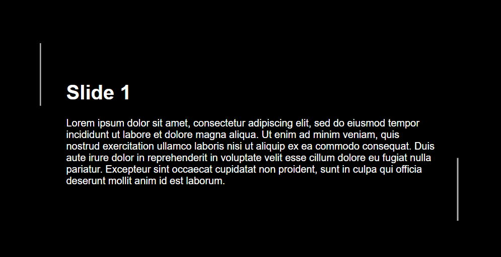

# HTML Slides Element
Simple 3-slides view element in elegant lines style
## Setup
Include `<script src="slides.js>` in head or end of body. Style is included to slides.js so you don't need to include this manually.
## Using slides component
```html
<app-slides>
    <div class="slide">
        <h1>Slide 1</h1>
        <p>
            Lorem ipsum dolor sit amet, consectetur adipiscing elit, sed do eiusmod tempor incididunt ut labore et dolore magna aliqua. Ut enim ad minim veniam, quis nostrud exercitation ullamco laboris nisi ut aliquip ex ea commodo consequat. Duis aute irure dolor in reprehenderit in voluptate velit esse cillum dolore eu fugiat nulla pariatur. Excepteur sint occaecat cupidatat non proident, sunt in culpa qui officia deserunt mollit anim id est laborum.
        </p>
    </div>
    <div class="slide">
        <h1>Slide 2</h1>
        <p>
            Lorem ipsum dolor sit amet, consectetur adipiscing elit, sed do eiusmod tempor incididunt ut labore et dolore magna aliqua. Ut enim ad minim veniam, quis nostrud exercitation ullamco laboris nisi ut aliquip ex ea commodo consequat. Duis aute irure dolor in reprehenderit in voluptate velit esse cillum dolore eu fugiat nulla pariatur. Excepteur sint occaecat cupidatat non proident, sunt in culpa qui officia deserunt mollit anim id est laborum.
        </p>
    </div>
    <div class="slide">
        <h1>Slide 3</h1>
        <p>
            Lorem ipsum dolor sit amet, consectetur adipiscing elit, sed do eiusmod tempor incididunt ut labore et dolore magna aliqua. Ut enim ad minim veniam, quis nostrud exercitation ullamco laboris nisi ut aliquip ex ea commodo consequat. Duis aute irure dolor in reprehenderit in voluptate velit esse cillum dolore eu fugiat nulla pariatur. Excepteur sint occaecat cupidatat non proident, sunt in culpa qui officia deserunt mollit anim id est laborum.
        </p>
    </div>
</app-slides>
```

## Control slides with javascript
```javascript
slides = document.getElementById('test-slides-gallery');

// next slide on click
slides.addEventListener('click', () => {
    slides.galleryClick();
});

// simple click with callback after slide change
slides.galleryClick(function(){
    console.log('Slide changed!')
});

// change lines width
// this always must be a string
// you can set %, px, em, rem, etc
slides.setLineLength('200px');
// and refresh slide
slides.setSlide(1); // or slides.setSlide(slides.slide);

// move now to third slide
slides.setSlide(3);

// slow move to third slide
// step by step (better for lines animation)
slides.setSlide(3, true);

// get current slide
slides.slide; // number

// get animation state
slides.animating; // boolean: running | paused

// current slides line length
slides.borderLineLength; // string
```

## Changing style
```css
#test-slides-gallery {
    width: 70vw;
    height: 30vw;
    --line-alpha: .7;
}
```